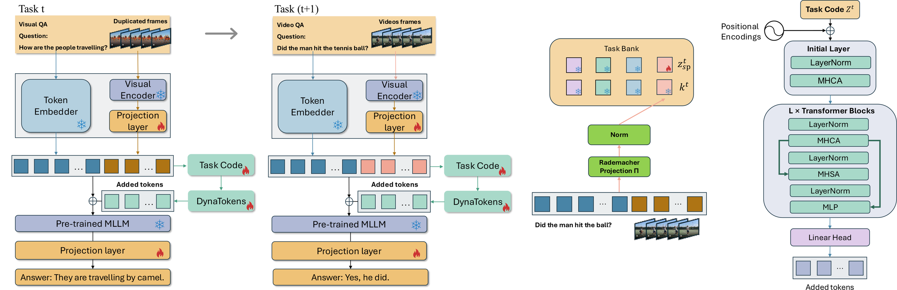
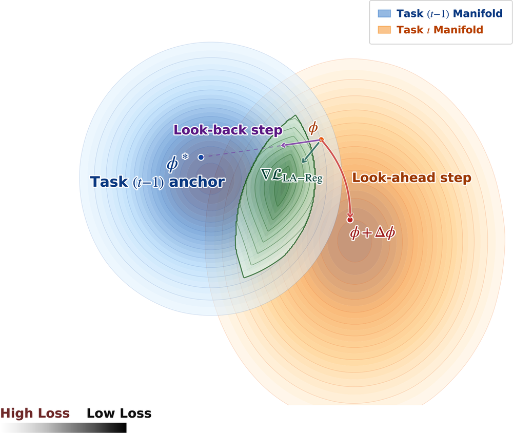
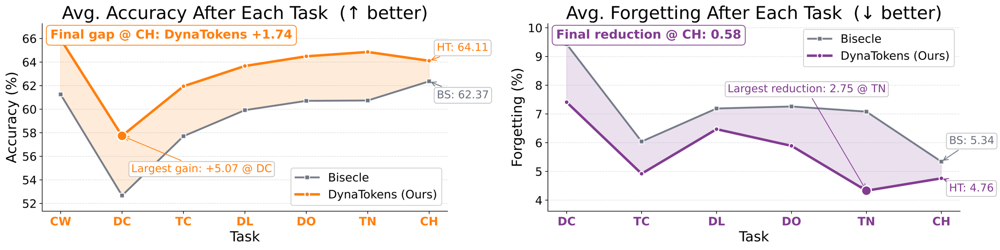
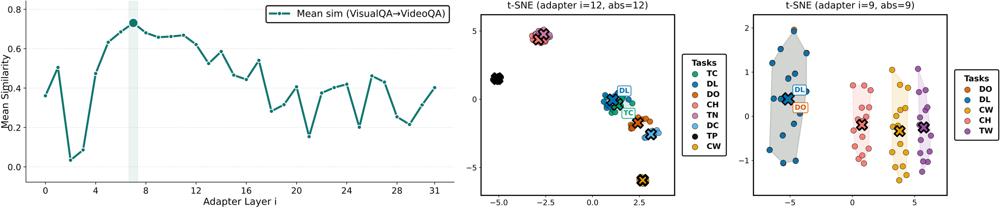

# DynaTokens: Controlling Token Dynamics for Continual Video-Language Understanding (EMNLP 2026)

Official PyTorch implementation of **DynaTokens** (EMNLP 2026), a
continual-learning method for multiple-choice VideoQA on top of a frozen
multimodal LLM (LLaMA-2-7B + CLIP ViT-L/14).

<p align="center">
  
</p>

**Overview.** (Left) Continual adaptation with DynaTokens for VideoQA and
cross-modal transfer VisualQA -> VideoQA: a *fixed-size* transformer token
generator synthesises *task-specific* fine-tuning tokens on demand from a
compact task code `z^t = [z_inv, z_sp^t]`, so memory grows only minimally
with the number of tasks. (Middle) The task bank is a key-value memory:
frozen multimodal embeddings are projected with a Rademacher projection
and normalised to form retrieval keys `k^t` that index the learnable
task-specific codes `z_sp^t`, giving gradient-free, task-agnostic routing at
inference. (Right) The token generator: layer-conditioned cross/self
attention blocks that map the code to the prompt tokens of every adapted
LLM layer.

Forgetting in the shared generator is controlled by a meta-learning-inspired
**LookAhead regulariser (LA-Reg)** that anchors the generator's *outputs* on
past task codes while looking ahead along the current-task update, plus an
invariance term on the shared code `z_inv`. The paper connects this objective
to sharpness-aware optimisation: it favours flatter cross-task minima.

<p align="center">
  
</p>

**Geometry of LA-Reg.** LA-Reg balances progress along the task-`t`
gradient with alignment to the task-`(t-1)` anchor, steering optimisation
into the shared low-loss basin (green) and yielding flatter cross-task
minima. Regularisation acts in prompt-output space, not parameter space.

> If DynaTokens helps your work, please cite the paper and give the repository a star.
>
> ```bibtex
> @inproceedings{nguyen2026dynatokens,
>   title     = {DynaTokens: Controlling Token Dynamics for Continual Video-Language Understanding},
>   author    = {Nguyen, Toan and Liu, Yang and De Melo, Celso and Salim, Flora D.},
>   booktitle = {Proceedings of the 2026 Conference on Empirical Methods in Natural Language Processing (EMNLP)},
>   year      = {2026}
> }
> ```

---

## 1. Results

Average accuracy (Acc, higher is better) and average forgetting (For, lower
is better) after the full task sequence. **Bold** = best, _underline_ =
second best. All methods share the same frozen LLaMA-2-7B + CLIP ViT-L/14
backbone with 32 adapter layers.

### Continual VideoQA (NExT-QA: 8 tasks, DramaQA: 5 tasks)

| Method | Venue | NExT-QA Acc ↑ | NExT-QA For ↓ | DramaQA Acc ↑ | DramaQA For ↓ |
|---|---|---:|---:|---:|---:|
| LLaMA-Adapter | ICLR'24 | 46.58 | 13.83 | 60.99 | 24.39 |
| L2P | CVPR'22 | 48.82 | 12.25 | 62.50 | 20.67 |
| DualPrompt | ECCV'22 | 50.62 | 11.74 | 65.89 | 17.93 |
| LAE | ICCV'23 | 49.38 | 11.47 | 65.82 | 17.35 |
| ProgPrompt | ICLR'23 | 53.95 | 10.69 | 67.92 | 14.95 |
| ColPro | EMNLP'24 | 55.14 | 7.43 | 71.24 | 12.64 |
| DAM | WACV'25 | 53.88 | 9.99 | 67.37 | 15.19 |
| Bisecle | NeurIPS'25 | _62.37_ | _5.34_ | _71.49_ | _10.37_ |
| **DynaTokens** | ours | **64.11** | **4.76** | **72.52** | **9.76** |

<p align="center">
  
</p>

Average accuracy (left) and forgetting (right) after each task of the
NExT-QA sequence: DynaTokens consistently surpasses Bisecle, with the gap
widening as tasks accumulate (largest single-task gain +5.07 Acc on DC and
-2.75 For on TN). TP is excluded from the accuracy plot (uniformly low at
the start) and TP-CW from the forgetting plot (forgetting starts at DC).

### Continual-dataset stream NExT-QA -> DramaQA (13 tasks)

| Method | Venue | Acc ↑ | For ↓ |
|---|---|---:|---:|
| ProgPrompt | ICLR'23 | 48.43 | _11.88_ |
| ColPro | EMNLP'24 | 54.18 | 12.49 |
| Bisecle | NeurIPS'25 | _55.31_ | 13.30 |
| **DynaTokens** | ours | **61.96** | **11.72** |

### Zero-shot inference (train on one benchmark, test on the other)

| Method | Venue | OOD on NExT-QA | OOD on DramaQA |
|---|---|---:|---:|
| ProgPrompt | ICLR'23 | _30.55_ | 39.24 |
| ColPro | EMNLP'24 | 27.73 | _51.47_ |
| Bisecle | NeurIPS'25 | 27.86 | 49.07 |
| **DynaTokens** | ours | **36.29** | **52.83** |

### Continual ImageQA -> VideoQA (Visual7W -> NExT-QA)

| Method | Venue | Visual7W Acc ↑ | Visual7W For ↓ | NExT-QA Acc ↑ | NExT-QA For ↓ |
|---|---|---:|---:|---:|---:|
| Bisecle | NeurIPS'25 | 41.90 | 28.89 | 58.24 | 5.93 |
| **DynaTokens** | ours | **43.44** | **27.92** | **62.31** | **5.02** |

Continual ImageQA -> VideoQA is harder than VideoQA alone and induces
slight negative transfer: Bisecle's NExT-QA accuracy drops from 62.37 to
58.24 (-4.13), DynaTokens only from 64.11 to 62.31 (-1.80).

### Ablations on NExT-QA

Contribution of the loss terms (`L_LA-Reg`: LookAhead regularisation,
`L_Inv`: invariance term on `z_inv`, `L_Aux`: weighted VAQ + QAV auxiliary
objectives) and effect of the number of look-ahead steps:

| L_LA-Reg | L_Inv | L_Aux | Acc ↑ | For ↓ |
|:---:|:---:|:---:|---:|---:|
| ✗ | ✗ | ✗ | 21.28 | 16.46 |
| ✗ | ✗ | ✓ | 54.54 | 8.83 |
| ✓ | ✗ | ✗ | 62.12 | 5.46 |
| ✓ | ✓ | ✗ | 62.41 | 5.19 |
| ✓ | ✗ | ✓ | _63.79_ | _4.88_ |
| ✓ | ✓ | ✓ | **64.11** | **4.76** |

| Look-ahead steps | Acc ↑ | For ↓ |
|:---:|---:|---:|
| no LA-Reg | 54.54 | 8.83 |
| 0 | 62.30 | 5.40 |
| 1 | _63.92_ | _5.02_ |
| 2 | **64.11** | **4.76** |

The 1-step variant halves training time (5.55 h -> 2.46 h on NExT-QA) and
trims peak memory by about 20% while still surpassing Bisecle; set
`--looking_head_steps 1` for this practical default.

### Deployment cost (per task, batch size 1)

| | Bisecle | ProgPrompt | DynaTokens |
|---|---:|---:|---:|
| Storage / task | ≈16 KB | ≈5 MB | ≈26 KB |
| Latency (ms / query) | 47.7 | 48.4 | 49.3 |

Per-task storage is a compact code that stays constant along the stream,
and inference latency is within about 3% of the baselines since prompt
synthesis is a single forward pass through the small generator.

### Token analysis

<p align="center">
  
</p>

(Left) Mean image-video prompt-token similarity across adapter layers after
Visual7W -> NExT-QA continual training: mid-layer semantics are largely
shared while late layers specialise for temporal reasoning. (Middle/Right)
t-SNE of task-specific prompt tokens at the most discriminative mid layer
(layer 12 on NExT-QA, layer 9 on DramaQA): tasks requiring similar
reasoning cluster together (e.g. DL/TC, DO/DL) while semantically distinct
tasks (CW, TP) are outliers, and clusters stay compact and well separated
after the whole continual trajectory.

---

## 2. Repository layout

```
DynaTokens/
├── train.py                      # continual training / evaluation loop (all benchmarks)
├── engine.py                     # train_one_epoch / val_one_epoch
├── llama_vqa.py                  # build_model(): LLaMA weights -> DynaTokensTransformer
├── llama/
│   ├── tokenizer.py              # SentencePiece tokenizer + VideoQA prompt templates
│   ├── dynatokens_model.py       # DynaTokensTransformer: frozen LLaMA + prompt tokens + routing
│   ├── dynatokens_components.py  # task code, retrieval keys, task bank, warm-start, regularisers
│   ├── token_generator.py        # token generator H_phi
│   └── lookahead_reg.py          # LookAhead regulariser (SI importance + merged anchor)
├── dataloader/
│   ├── base_dataset.py           # shared tokenisation / video sampling
│   ├── nextqa.py                 # NExT-QA, one task per question type
│   ├── dramaqa.py                # DramaQA, one task per question type
│   └── visual7w.py               # Visual7W-telling, single pre-training task "visualqa"
├── util/
│   ├── misc.py                   # distributed helpers, metric logger, AMP scaler
│   └── lr_sched.py               # warm-up + cosine schedule
├── scripts/
│   ├── run_nextqa.sh             # NExT-QA (8 tasks)
│   ├── run_dramaqa.sh            # DramaQA (5 tasks)
│   ├── run_nextqa_dramaqa.sh     # cross-dataset stream NExT-QA -> DramaQA (13 tasks)
│   ├── run_visual7w.sh           # Visual7W pre-training (single task)
│   └── run_nextqa_from_visual7w.sh   # NExT-QA initialised from the Visual7W checkpoint
├── tools/
│   └── extract_visual7w_clip_features.py   # CLIP ViT-L/14 image features for Visual7W
├── assets/                       # figures used in this README
├── data/
│   ├── nextqa/split_data/        # per-question-type CSV splits (included)
│   ├── dramaqa/split_data/       # per-question-type JSON splits (included)
│   └── visual7w/                 # 80/20 image-level split of Visual7W-telling (included)
├── environment.yml
└── LICENSE
```

Every source file starts with a docstring describing its purpose and the
functions/classes it provides.

---

## 3. Installation

Python 3.10, PyTorch 2.6.0 (CUDA 12.4). The whole environment is created
from `environment.yml`:

```bash
git clone https://github.com/cruiseresearchgroup/DynaTokens.git
cd DynaTokens
conda env create -f environment.yml
conda activate dynatokens
```

`wandb` is installed but only used with `--use_wandb`.

---

## 4. Pretrained backbone and data

### 4.1 LLaMA-2-7B

Download the original Meta checkpoint of LLaMA-2-7B (request access at
https://ai.meta.com/llama/) and place the files in one folder:

```
checkpoints/Llama-2-7b/
├── params.json
├── tokenizer.model
└── consolidated.00.pth
```

Point `--llama_model_path` (or `LLAMA_PATH` in the scripts) to this folder.

### 4.2 Video features and question splits

The models consume pre-extracted **CLIP ViT-L/14 frame features** (768-d)
released by [Flipped-VQA](https://github.com/mlvlab/Flipped-VQA)
(`clipvitl14.pth`, one `(T, 768)` tensor per video/clip id). The question
splits per question type are already included in `data/`.

```
data/
├── nextqa/
│   ├── split_data/{train,val}_{TP,CW,DC,TC,DL,DO,TN,CH}.csv    (included)
│   └── clipvitl14.pth                                          (download)
├── dramaqa/
│   ├── split_data/AnotherMissOhQA_{train,val}_set_{TW,DO,DL,CH,CW}.json   (included)
│   └── clipvitl14.pth                                                     (download)
└── visual7w/                     (only for the Visual7W -> NExT-QA experiments)
    ├── train.json, val.json      (included; 80/20 image-level split, seed 42, see split_meta.json)
    └── clipvitl14.pth            (extract, see below)
```

Download the NExT-QA and DramaQA feature files from the Flipped-VQA release
(https://github.com/mlvlab/Flipped-VQA, section *Dataset & LLaMA Preparation*)
and copy `nextqa/clipvitl14.pth` and `dramaqa/clipvitl14.pth` into the
corresponding folders. A different location can be given with `--data_root`
(or `DATA_ROOT` in the scripts).

**Visual7W features.** Download the Visual7W-telling images
(http://ai.stanford.edu/~yukez/visual7w/, files `v7w_<image_id>.jpg`) and
extract one CLIP ViT-L/14 embedding (768-d, OpenAI weights) per image with
the provided tool:

```bash
pip install open_clip_torch pillow tqdm
python tools/extract_visual7w_clip_features.py \
    --dataset_json data/visual7w/train.json data/visual7w/val.json \
    --image_roots /path/to/visual7w/images \
    --out_dir data/visual7w
```

This writes `data/visual7w/clipvitl14.pth` as
`{"features": {image_id: tensor(768)}, "filenames": {...}, "meta": {...}}`.
The work can be split over several jobs with `--num_shards N --shard_id i`
and merged with `--merge` (see the docstring of the tool). The loader repeats
the image embedding `max_feats` times so that an image is treated as a
static video.

---

## 5. Training and evaluation

All scripts run the same continual protocol: tasks (question
types) are trained one after another; after every epoch the model is
evaluated on the validation split of **all tasks seen so far** with
task-agnostic routing through the task bank, and the average accuracy,
routing accuracy and forgetting are printed and written to
`<output_dir>/acc_forgetting_stats.csv` and `<output_dir>/log.txt`.

### 5.1 NExT-QA (8 tasks: TP, CW, DC, TC, DL, DO, TN, CH)

```bash
bash scripts/run_nextqa.sh
```

Default configuration (paper): 2 GPUs, batch 4 x accumulation 16 (effective
128), 5 epochs per task, `blr=1e-2`, `token_gen_lr=1e-3`, `z_inv_lr=1e-3`,
`z_sp_lr=1e-3`, LookAhead `alpha=0.25` with 2 inner steps, `lambda_inv=0.1`,
question-only retrieval keys, VAQ + QAV auxiliary losses.

### 5.2 DramaQA (5 tasks: TW, DO, DL, CH, CW)

```bash
bash scripts/run_dramaqa.sh
```

Default configuration (paper): 1 GPU, batch 4 x accumulation 32 (effective
128), 6 epochs per task, `blr=1.5e-2`, `token_gen_lr=1e-3`, `z_inv_lr=5e-4`,
`z_sp_lr=1e-3`, LookAhead `alpha=0.5` with 2 inner steps, `lambda_inv=0.1`,
question-only retrieval keys, VAQ auxiliary loss.

### 5.3 Cross-dataset stream NExT-QA -> DramaQA (13 tasks)

```bash
bash scripts/run_nextqa_dramaqa.sh
```

The 8 NExT-QA tasks are followed by the 5 DramaQA tasks in one continual
stream; task keys are namespaced (`nextqa:TP`, ..., `dramaqa:CW`). Shared
settings: `adapter_len=15`, `max_seq_len=280`, 2 GPUs, batch 4 x accumulation
16, 6 epochs per task, `blr=8e-3`, all component LRs `8e-4`, LookAhead
`alpha=0.3`, `lambda_inv=0.1`, question-only keys, VAQ loss.

### 5.4 Visual7W pre-training -> NExT-QA

```bash
# 1) pre-train on Visual7W as a single task "visualqa" (saves visualqa_pretrain_{best,last}.pth)
bash scripts/run_visual7w.sh

# 2) NExT-QA stream initialised from that checkpoint
RESUME_CKPT=./outputs/visual7w/<exp_name>/visualqa_pretrain_best.pth bash scripts/run_nextqa_from_visual7w.sh
```

Step 2 uses `--resume <ckpt> --resume_mode init`: only the shared modules
(token generator, gates, temporal embedding, video projection) are loaded;
the task code and the task bank start empty, so the NExT-QA stream is
evaluated exactly as in Section 5.1. Visual7W pre-training: 1 GPU, batch 16 x
accumulation 64, 10 epochs, `blr=1.25e-3`, `token_gen_lr=1e-3`,
`z_inv_lr=5e-4`, `z_sp_lr=1e-3`, raw (question + image) keys, VAQ loss.

### 5.5 Customising a run

All settings of the scripts are environment variables, for example

```bash
# single GPU with the same effective batch size
NGPUS=1 ACCUM_ITER=32 bash scripts/run_nextqa.sh

# custom paths, W&B logging and checkpoints
LLAMA_PATH=/models/Llama-2-7b DATA_ROOT=/datasets USE_WANDB=true SAVE_CKPT=true \
  bash scripts/run_dramaqa.sh

# oracle routing (ground-truth task id at inference)
USE_TASK_ID=true bash scripts/run_nextqa.sh

# a subset / different order of tasks (task keys of the benchmark)
python train.py --dataset nextqa_dramaqa --task_order nextqa:TP,nextqa:CW,dramaqa:TW ...
```

or call `train.py` directly (`python train.py --help` lists every option):

```bash
torchrun --standalone --nproc_per_node=2 train.py \
  --dataset nextqa --data_root ./data --llama_model_path ./checkpoints/Llama-2-7b \
  --batch_size 4 --accum_iter 16 --epochs 5 --blr 1e-2 \
  --token_gen_lr 1e-3 --z_inv_lr 1e-3 --z_sp_lr 1e-3 \
  --alpha 0.25 --looking_head_steps 2 --lambda_inv 0.1 --key_mode question \
  --vaq --qav --weight_aux_vid_loss 0.75 --output_dir ./outputs/nextqa/run1
```

On a PBS cluster the scripts can be submitted as they are
(`qsub scripts/run_nextqa.sh`) after setting `CONDA_SH` and the `#PBS`
resource lines.

### 5.6 Checkpoints

With `SAVE_CKPT=true` (`--save_best --save_last`) the trainable parameters
(token generator, task code, gates, video projection), the retrieval-key
buffers and the task bank are saved to `<output_dir>/<ckpt_name>_{best,last}.pth`
(the frozen LLaMA weights are not stored, about 40 MB per checkpoint).
A checkpoint is loaded with `--resume path/to/ckpt.pth`; `--resume_mode full`
(default) also restores the task code and the task bank so a stream can be
continued (new tasks are appended to the loaded bank), `--resume_mode init`
loads only the shared modules (Visual7W -> NExT-QA transfer).

### 5.7 Ablations

* `--use_task_id` oracle routing with the ground-truth task id.
* `--code_mode {dissimilar,random,zsp_zero,zinv_zero}` code-swap analysis at
  inference (least-similar task, random `z_sp`, `z_inv` only, `z_sp` only).
* `--alpha 0` disables the LookAhead term; `--lambda_inv 0` disables the
  `z_inv` invariance term; `--key_mode raw` uses question + video keys.
* `--task_order TP,CW,...` (or `nextqa:TP,dramaqa:TW,...`) selects / re-orders tasks.

---

## 6. Main hyper-parameters

| Argument | Meaning | Paper |
|---|---|---|
| `--adapter_layer`, `--adapter_len` | layers receiving prompts / prompt tokens per layer | 32 / 10 (NExT-QA), 15 (DramaQA) |
| `N_z`, `C_z`, `internal_dim` (`llama/dynatokens_model.py`) | task-code tokens, code width, generator width | 30, 256, 384 |
| `--token_gen_lr`, `--z_inv_lr`, `--z_sp_lr` | per-component learning rates | see scripts |
| `--alpha`, `--looking_head_steps`, `--inner_lr_scale` | LookAhead weight, inner steps, inner LR scale | 0.25 / 0.5, 2, 0.5 |
| `--start_merge_epoch`, `--mask_topk_percent` | merged-anchor schedule and sparsity | see scripts |
| `--lambda_inv` | weight of `\|\|z_inv - z_inv*\|\|^2` | 0.1 |
| `--key_mode`, `--d_k`, `--key_ema_beta` | retrieval keys | question, 256, 0.99 |
| `--rho_z` | warm-start temperature | 0.1 |

---

## 7. Acknowledgements

The backbone, tokenizer and the VQA / VAQ / QAV prompt templates are adapted
from [Flipped-VQA](https://github.com/mlvlab/Flipped-VQA) and
[LLaMA](https://github.com/facebookresearch/llama); the distributed utilities
from [MAE](https://github.com/facebookresearch/mae). This research was
supported by the US Army International Technology Center Pacific (ITC-IPAC)
under Contract No. FA520923C0020, with compute provided by ResetData, NCI
Australia (NCRIS) and the UNSW Katana cluster.

## License

Released under the license in [LICENSE](LICENSE). The LLaMA components keep
their original license terms.
